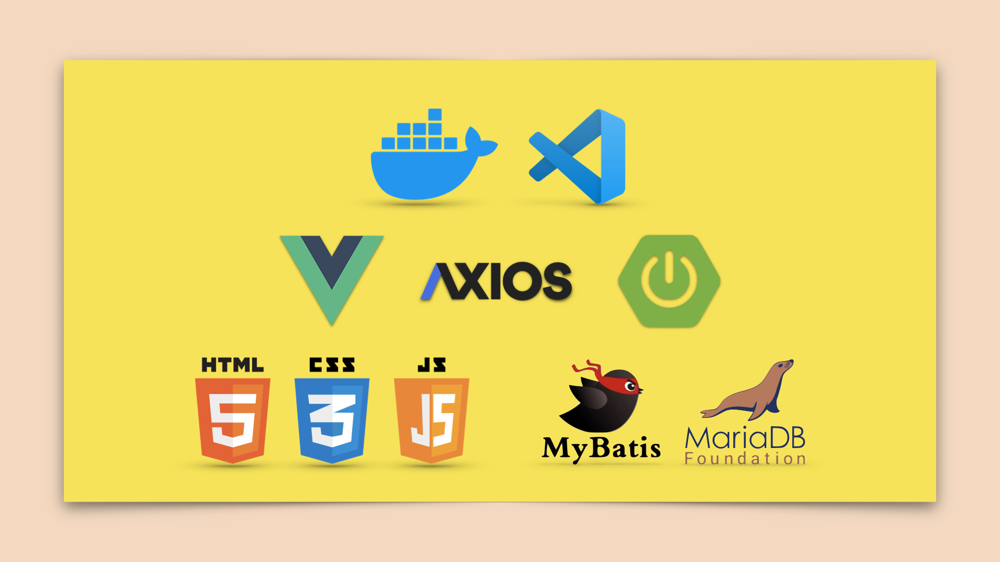

# DevBlog
DevContainer + Blog Project

### Architecture of Blog Project
</img>

###### Vue Project 만들기

```
vue -V

vue create 프로젝트명

cd 프로젝트명

yarn serve
```

###### java version 확인

```
java --version
```

### Spring Project
> * [Spring initializr](https://start.spring.io/)
> * [Application Properties](https://docs.spring.io/spring-boot/docs/current/reference/html/application-properties.html)


----
### YouTube Link

###### 1. DevBlog 소개 [SpringBoot Vue]
[](https://youtu.be/oZcTz9lYOqw)

###### 2. DevBlog 프로젝트 생성 [SpringBoot Vue]
[](https://youtu.be/9X4LIJJ4SlQ)

###### 3. DevBlog 테이블 정의 소개 [DDL ERD]
[](https://youtu.be/mpc99M_r_2M)

###### 4. DevBlog 화면 정의 소개 [SpringBoot Vue]
[](https://youtu.be/oxW46UYkBFs)

###### 5. DevBlog 화면 코드 소개 [SpringBoot Vue]
[](https://youtu.be/Uk7plVujni0)

###### 6. DevBlog 진행사항 살펴보기 [SpringBoot Vue]
[](https://youtu.be/2fWKPBKV30w)

###### 7. DevBlog Source Tree [SpringBoot Vue]
[](https://youtu.be/vIPpkJu4acU)

###### 8. DevBlog Boot 기능 구현 1부 [SpringBoot Vue]
[](https://youtu.be/I9eJuQevfD0)

###### 9. DevBlog Controller 단위 테스트 [SpringBoot Vue]
[](https://youtu.be/hiPMGrFPQgU)
